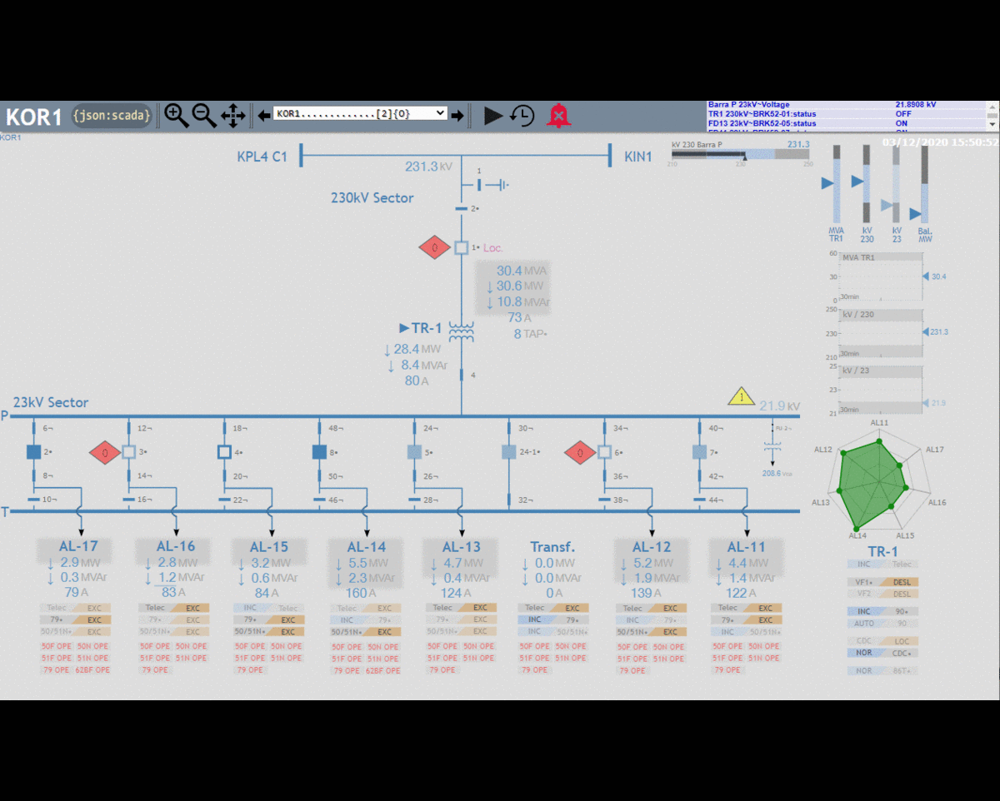

# {json:scada}

A portable and scalable SCADA/IoT platform centered on the MongoDB database server.

## Major features and characteristics
* Standard IT tools applied to SCADA/IoT (MongoDB, PostgreSQL/TimescaleDB,Node.js, C#, Golang, Grafana, etc.).
* MongoDB as the real-time core database, persistence layer, config store, SOE historian.
* Portability and interoperability over Linux, Windows, x86/64, ARM.
* Horizontal scalability, from a single computer to big clusters (MongoDB-sharding), Docker containers, VMs, Kubernetes, cloud, or hybrid deployments.
* Unlimited tags, servers, and users.
* Modular distributed architecture. Lightweight redundant data acquisition nodes can connect securely over TLS to the database server. E.g. a Raspberry PI can be a data acquisition node.
* MongoDB Change Streams for realtime async database events processing.
* HTML5 Web interface. UTF-8/I18N. Mobile access.
* Inkscape-based SVG synoptic display editor.
* IEC60870-5-101/104 client and server protocols. IEC60870-5-104 client with TLS support.
* DNP3 Client (TCP, UDP, Serial and TLS).
* CIP Ethernet/IP PLCTags client driver (experimental).
* PostgreSQL/TimescaleDB historian integrated with Grafana for easy creation of dashboards.
* Extensibility of data model (MongoDB: NoSQL/schema-less).
* Development of custom applications with modern stacks like MEAN/MERN, etc.
* Big data / ML capabilities through MongoDB Spark connector.
* Access to the MongoDB ecosystem of tools, community, services, etc.
* Easy to understand system with small code size for each independent module. Extensive use of JSON from bottom up.
* Possibility of easy integration of new and custom protocol drivers developed with modern programming languages.
* Future-proof, vendor independence, flexibility, extensibility.
* Reduced human costs for maintenance and development thanks to the employment of widely-used open-source IT technologies.
* Live point configuration updates.
* Role-based access control and web-based configuration management (now under development).
* Planned protocol drivers: OPC-UA, DNP3 Server, MODBUS, MQTT.
* Planned integrations: InfluxDB/Telegraf, NodeRed, MS Power BI.

## Use cases
* Power/Oil/Gas/etc Local Station HMI.
* Manufacturing Local HMI.
* SCADA Protocol Gateway.
* SCADA Control Center Full System.
* SCADA/IoT Historian. MS Power BI integration.
* Intranet/Internet HTTPS Gateway - Visualization Server.
* Multilevel Systems Integrator (SCADA/IoT/ERP/MES/PLC).
* Global-Level SCADA Systems Integration/Centralization.
* Extensible Development Platform For Data Acquisition And Processing.
* Data concentrator for Big Data / ML processing.

## Screenshots

## Architecture

## Documentation

* [Screenshots](docs/screenshots/)
* [Docker Demo](demo-docker/README.md)
* [Config File](conf/README.md)
* [Calculations](src/calculations/README.md)
* [IEC60870-5-104 Server Driver](src/lib60870.netcore/iec104server/README.md)
* [IEC60870-5-104 Client Driver](src/lib60870.netcore/iec104client/README.md)
* [IEC60870-5-101 Server Driver](src/lib60870.netcore/iec101server/README.md)
* [IEC60870-5-101 Client Driver](src/lib60870.netcore/iec101client/README.md)
* [DNP3 Client Driver](src/dnp3/Dnp3Client/README.md)
* [CIP Ethernet/IP PLCTags Client Driver](src/libplctag/PLCTagsClient/README.md)
* [I104M Client Driver](src/i104m/README.md)
* [Change Stream Data Processor](src/cs_data_processor/README.md)
* [Realtime Data Server](src/server_realtime/README.md)
* [SVG Synoptic Display Editor](src/svg-display-editor/README.md)
* [OSHMI2JSON Tool](src/oshmi2json/README.md)
* [Schema Documentation](docs/schema.md)
* [Install Guide](docs/install.md)

## Requirements

* Node.js 14+.
* Dotnet Core 3.1+.
* Golang 1.14+.
* MongoDB 4.2+.
* PostgreSQL 12+.
* TimescaleDB 1.7+.
* Grafana 7.0+.

## Contact

https://www.linkedin.com/in/ricardo-olsen/
