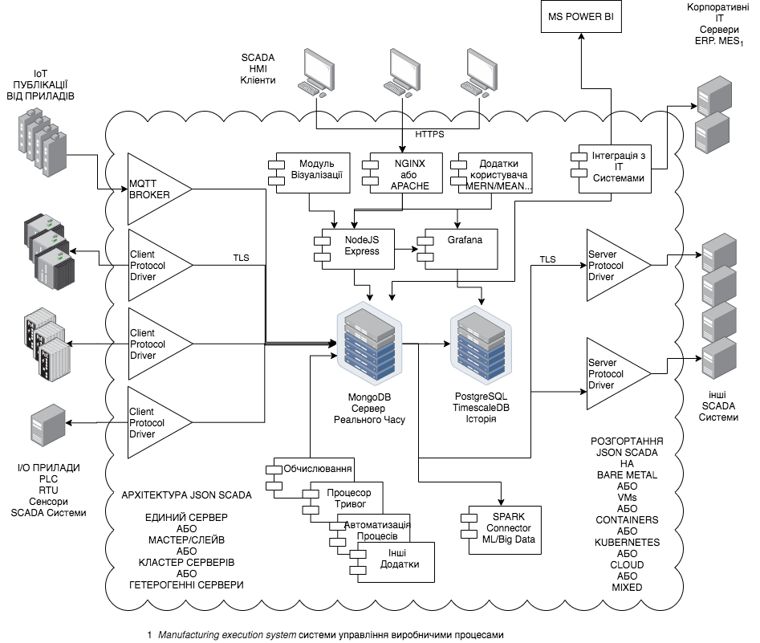

# {json:scada}

Портативна і масштабуюча платформа SCADA/IoT, згуртована навкруги сервера баз даних MongoDB.

## Основні особливості та характеристики

- Стандартні додатки ІТ, згуртовані навкруги SCADA/IoT (MongoDB, PostgreSQL/TimescaleDB, Node.js, C #, Golang, Grafana тощо).
- MongoDB як основна база даних у режимі реального часу, рівень збереження, сховище конфігурацій, історія.
- Переносимість та сумісність з Linux, Windows, x86/64, ARM.
- Горизонтальна масштабованість - від одного комп’ютера до великих кластерів (MongoDB-sharding), контейнерів Docker, VM, Kubernetes, хмари або гібридні розгортання.
- Необмежена кількість тегів, серверів та користувачів.
- Модульна розподілена архітектура. Легкі надлишкові вузли збору даних (fog computing) можуть надійно підключатися через TLS до сервера баз даних. Наприклад BigleBone може бути вузлом збору даних, або роутери iRZ.
- Зміни потоків MongoDB для асинхронної обробки подій бази даних в режимі реального часу.
- Веб-інтерфейс HTML5. UTF-8/I18N. Мобільний доступ.
- Редактор SVG на основі Inkscape.
- Протоколи клієнтів і серверів IEC60870-101/104.
- PostgreSQL/TimescaleDB, інтегрований з Grafana, для зручного створення інформаційних панелей.
- Розширення моделі даних (MongoDB: NoSQL/schema-less).
- Розробка нестандартних додатків із сучасними стеками типу MEAN/MERN тощо. Mongo/Express/Angular(React)/Node .
- BigData/ML через роз'єм MongoDB до Apache Spark.
- Доступ до екосистеми MongoDB інструментів, спільноти, послуг тощо.
- Легка для розуміння система з невеликим розміром коду для кожного незалежного модуля. Широке використання JSON знизу вгору.
- Можливість легкої інтеграції нових та спеціальних драйверів протоколів, розроблених із сучасними мовами програмування.
- Незалежність від постачальників, гнучкість, розширюваність.
- Скорочення людських витрат на обслуговування та розвиток завдяки використанню широко використовуваних ІТ-технологій з відкритим кодом.
- Оновлення конфігурації наживо.
- Плани щодо драйверів та протоколів: OPC-UA, DNP3, MODBUS, MQTT, Ethernet/IP.
- Заплановані інтеграції з: InfluxDB/Telegraf, NodeRed, MS Power BI

## Випадки використання

- Електро/Нафто/Газо/Комунальних організаціях, локальне устаткування HMI.
- Виробництво на невеликих, локальних HMI.
- Шлюз протоколу SCADA.
- Глобальна система SCADA Control Center.
- Історичні данні SCADA/IoT. Інтеграція MS Power BI.
- Інтранет/Інтернет HTTPS шлюз - сервер візуалізації.
- Багаторівневий системний інтегратор (SCADA/IoT/ERP/MES/PLC).
- Інтеграція/централізація систем SCADA глобального рівня.
- Розширювана платформа розвитку для збору та обробки даних.
- Концентратор даних для обробки BigData/ML.

## Архітектура

## License

    {json:scada} A portable SCADA/IoT platform centered on the MongoDB database server.
    Copyright (C) 2020 Ricardo L. Olsen

    This program is free software: you can redistribute it and/or modify
    it under the terms of the GNU General Public License version 3 as published by the Free Software Foundation.

    This program is distributed in the hope that it will be useful,
    but WITHOUT ANY WARRANTY; without even the implied warranty of
    MERCHANTABILITY or FITNESS FOR A PARTICULAR PURPOSE.  See the
    GNU General Public License for more details.

    You should have received a copy of the GNU General Public License
    along with this program.  If not, see <https://www.gnu.org/licenses/>.

## Contributors License Agreement - CLA

Contributors are welcome. Pull request authors must agree with this CLA.

You, the Contributor, accept and agree to the following terms and conditions for Your present and future Contributions submitted to this project. Except for the license granted herein to this project author, You reserve all right, title, and interest in and to Your Contributions.

Licenses

This project (code, documentation, and any other materials) is released under the terms of the individual licenses as noted in the project's repository, or, if no separate license is specified, under the terms of the GPL3 license.

You certify that:

- (a) Your Contributions are created in whole or in part by You and You have the right to submit it under the designated license; or

- (b) Your Contributions are based upon previous work that, to the best of your knowledge, is covered under an appropriate open source license and You have the right under that license to submit that work with modifications, whether created in whole or in part by You, under the designated license; or

- (c) Your Contributions are provided directly to You by some other person who certified (a) or (b) and You have not modified them.

- (d) You understand and agree that Your Contributions are public and that a record of the Contributions (including all metadata and personal information You submit with them) is maintained indefinitely in the project repositories and all its forks.

- (e) You are granting Your Contributions to this project under the terms of the license as noted in the project's repository.

- (f) Contributors must provide name, email or social network contact and the phrase "I AGREE with the Contributors License Agreement of the project.".

## Documentation

- [Docker Demo](demo-docker/README.md)
- [Calculations](src/calculations/README.md)
- [IEC60870-5-104 Server Driver](src/lib60870.netcore/iec104server/README.md)
- [IEC60870-5-104 Client Driver](src/lib60870.netcore/iec104client/README.md)
- [IEC60870-5-101 Server Driver](src/lib60870.netcore/iec101server/README.md)
- [IEC60870-5-101 Client Driver](src/lib60870.netcore/iec101client/README.md)
- [I104M Client Driver](src/i104m/README.md)
- [Change Stream Data Processor](src/cs_data_processor/README.md)
- [Realtime Data Server](src/server_realtime/README.md)
- [SVG Synoptic Display Editor](src/svg-display-editor/README.md)
- [OSHMI2JSON Tool](src/oshmi2json/README.md)
- [Schema Documentation](docs/schema.md)

## Requirements

- Node.js 14.
- Dotnet Core 3.1.
- Golang 1.14.
- MongoDB 4.2.
- PostgreSQL 12.
- TimescaleDB 1.7.
- Grafana 7.0.

## Contact
