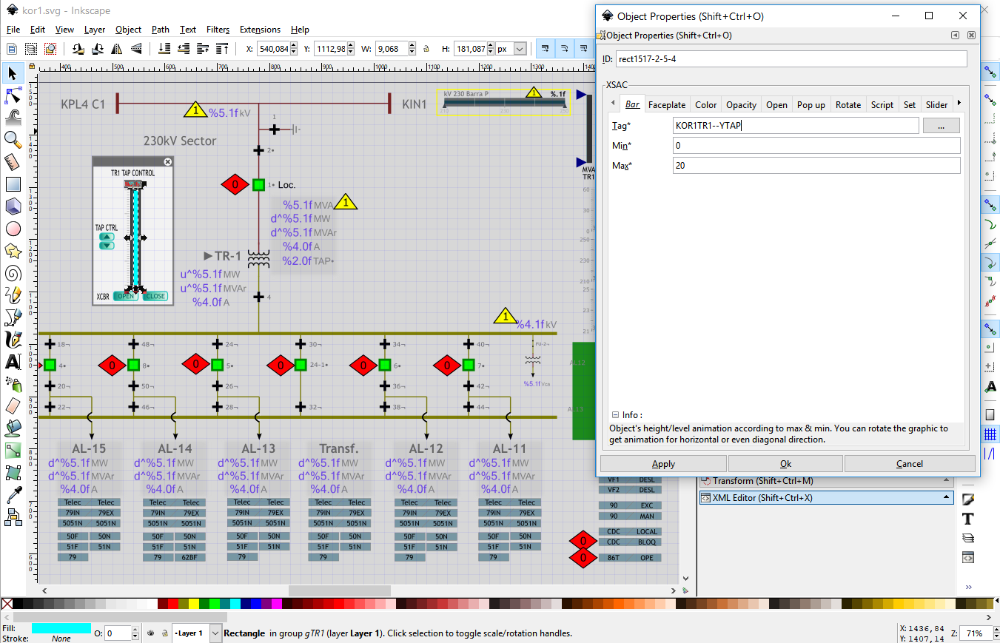

# SVG Synoptic Display Editor

This is a separate project. This editor is based on the popular open-source Inkscape editor, it was modified to allow markup SCADA-like animations in the SVG file with links to data that can be later provided at runtime.
Any graphics properties can be animated with live data, such as fill/stroke colors, size, position, rotation, etc.

## Source Code

* [Display Editor Source Code](https://gitlab.com/ricardolo/inkscape)

## Installers

Windows binaries are include in the {json:scada} installer for Windows 64 bits.

It can also be acquired here the standalone Microsoft Store version for Windows 10 (Certified Binary).

* [Microsoft Store Binary](https://www.microsoft.com/store/apps/9P9905HMKZ7X?ocid=periscope)

## Creating Displays

To create a new display

1. Create the SVG graphics using the Synoptic Editor. It is possible to use other editors (Illustrator, Corel, etc.) to create graphics that can be imported in the Synoptic Editor to later markup. The editor can import graphics from a great number of formats. There are on the web many sources of vector graphics clipart (free and paid) that can be useful. It is recommended to configure each new display file with a size of 2400 x 1500 pixels (File | Document Properties | Page | Page Size | Custom Size). This is a reference size, the actual drawing can be larger.

2. Markup the animations you want in the graphics using the Synoptic Editor. For this, select the object you want to animate and click the mouse right button and select “Object Properties”. Then choose from the menu the properties you want to animate. Follow the documentation below to understand the parameters of animations. Always use JSON-SCADA TAGs as identifiers of values to animate the graphics at runtime in the web browser. Finally, save the file always using the default native Inkscape SVG format. 

3. If you are editing on the JSON-SCADA server, save the file to "C:\json-scada\src\htdocs\svg" or equivalent folder. Add the file to display lists in the "C:\json-scada\src\htdocs\svg\screen_list.js" file. Open the Display Viewer web browser. The viewer can be also directly opened with a URL like this "http://127.0.0.1:8080/display?SVGFILE=filename.svg".

## Tag naming

Tag names are strings that must always begin with a letter (a-z or A-Z). Tags beginning with a number like “21xyz” will be converted to numbers and will cause problems. Do not begin a tag with any symbol, symbols are reserved for special purposes. If necessary, prefix your tag names with letters to avoid problems.
Point numbers (_id field of _realtimeData_ collection) also can be used to identify points in the SVG Editor. There is no limit on the size of the tag string. Tag names should be unique across the whole point database.

## Standard Inkscape Usage

To learn how to use the Inkscape SVG graphics editor there is plenty of material available throughout the web. We just point some useful resources here.

* Inkscape official manual 
	http://tavmjong.free.fr/INKSCAPE/MANUAL/html/

* Inkscape tutorials, books, videos, etc. 
	https://inkscape.org/en/learn/ 

An interactive tutorial is available inside the editor in many languages (menu Help | Tutorials).

Other interesting related resources.

* https://www.opto22.com/support/resources-tools/demos/svg-image-library
* https://github.com/willianjusten/awesome-svg
* https://github.com/PanderMusubi/inkscape-open-symbols
* https://sourceforge.net/projects/oshmiopensubstationhmi/files/svg-clipart.zip/download
* https://www.svgrepo.com
* https://www.vecteezy.com

## SCADA Animations

To edit SCADA animation properties of an SVG object, right-click the mouse and choose Object Properties (please notice that albeit the Inkscape software interface is localized in many languages, the Object Properties menu is only available in English).

Editor interface showing the “Object Properties” dialog.

Follow below a list of attributes that can be utilized to animate graphics.

Get  Color  Bar  Opacity  Rotate  Tooltips  Slider  Zoom 
Script  Text  Faceplate  Popup  Set  Open  Special Codes

Desired Action | Tab
-------------- | ---
Show formatted values as text | Get
Define texts for specified values | Text
Change color of drawing objects | Color
Change SVG attributes of drawing objects | Color
Load images | Color
Run animations | Color
Execute scripts | Color, Script, Set
Associate mouse/keyboard events | Script
Bar graph | Bar
Arc, Donut | Set (#arc)
Radar chart | Set (#radar)
Generic charts | Set (#vega4, #vega4-json #vega-lite)
Control transparency | Opacity, Color
Rotate objects | Rotate
Create tooltips (on mouse over text) | Tooltips
Move objects linearly | Slider
Zoom to area when object clicked | Zoom
Control action when object is clicked | Popup
Create Trend Plot | Open
Open New Display | Open
Preview Displays (on mouse over) | Open
Create indirect variables | Faceplate
Clone object properties | Set (#copy_xsac_from)
Object models | Faceplate (group) + Set (#copy_xsac_from)

### Get Tab

**Purpose**: retrieve and show formatted values for tags.

**Available for**: SVG text objects only.

In the Tag field, put the tag to be retrieved its value. The fields _Alignment_ and _Type_ are ignored. To align text use the Inkscape “Text and Font” menu.

There are 3 ways to format values obtained by the “Get” directive. 

When the text of the object contains the “|” (pipe) character, it is used the **Boolean** convention. When the text contains the “%” character, it is be used the  **Printf** convention. In all other cases it is used the **d3** convention.

* **Printf** convention.

    To format values it is possible to use the standard C language _printf_ convention in the text of the object (e.g: “%5.2f”). For analog values, use “%f”. For string values, use “%s”.  
    
    For a complete _printf_ convention reference, see 

    * http://www.cplusplus.com/reference/cstdio/printf/

    * https://alvinalexander.com/programming/printf-format-cheat-sheet

    This convention can be used to format number and string values.

* **d3** convention.

    The **d3** format convention can also be used.
    The character “~” should be used in place of “%” when d3.format percent convention is necessary.
    The default locale is US English to change it, call d3.formatLocale from a script.
    This convention can be used to format only numeric values.

    For a reference see

    * https://github.com/d3/d3-format

    * http://bl.ocks.org/zanarmstrong/05c1e95bf7aa16c4768e

* **Boolean** convention.

    For boolean values, use “off_text|on_text|failed_text”, to show custom texts based on the tag value and quality.

It's possible to represent flow direction for analog values with an arrow in place of the value signal using the following codes (positioned where you want the arrow to be shown):

* 'u^': up pointing arrow for positive values (down for negative values).
* 'd^': down pointing arrow for positive values (up for negative values).
* 'r^': right pointing arrow for positive values (left for negative values).
* 'l^': left pointing arrow for positive values (right for negative values).
* 'a^': shows only the absolute value.

Examples of formatting using the _printf_ convention. Considering the value = -23.456:	

format  | presented value 
------- | ---------------
%6.2f   | -23.47
%08.3f  | -023.456
%1.0f   | -23
%5.2fu^ |  23.47↓
l^%.1f  |  →23.1

Examples of formatting using the _d3_ convention. Considering the value = 123456789.123:	

format  | presented value 
------- | ---------------
s       | 123.456789123M
.3s     | 123M

Examples of formatting using the _boolean_ convention. Considering the value = 1 (true):	

format           | presented value 
---------------- | ---------------
off\|on          | on
stopped\|running | running

### Color Tab

**Purpose**: change the fill/stroke color of objects according to limits for the value of points. It is also possible to change attributes, trigger SMIL animations, load images and run small scripts.

**Available for**: all SVG drawing object types (not available for groups).

Each line in the list of limits contains the following fields:

* **Tag**: tag identifier.
* **Limit**: value limit, the color defined in the same row will be used for values equal to or greater than this limit.
* **Color Name/Code**: desired color (SVG named color or #RRGGBB value).

The last true condition of the list will be effective and the others are ignored.

The field “Limit” can have also some special coded values:

* 'a' - for alarmed value (the point has a not yet acknowledged alarm state)
* 'f' - for a failed (invalid quality) value

For digital (boolean) points the following special values for conditions apply:

* 0 – invalid state
* 1 – false (off) state
* 2 – true (on) state
* 3 - transit state
* 130 – invalid state and bad quality
* 129 – false (off) state and bad quality
* 130 – true (on) state and bad quality
* 131 - transit state and bad quality

The colors are the SVG colors (named or #RRGGBB value). “none” is the transparent color.

A single color value will be used as fill and stroke colors. To specify different fill and stroke separate 2 color values by a “|” (pipe) character. Example: “red|green” = red for fill and green for stroke.

A void fill color like in “|yellow” affects only the stroke while keeping the fill unaltered.
A void stroke color like in “black|” affects only the fill while keeping the stroke unaltered (recommended for text objects).

To interpolate colors between 2 values, use @color in the color field (fill or stroke) in the final line. Example: To make fill colors that varies continuously between white and red proportionally to values between 0 and 10 for the tag “TAG1”.

Tag  | Limit | Color Name/Code
---- | ----- | ---------------
TAG1 | 0     | white\|
TAG1 | 10    | @red\|

In the field “Color Name/Code” it's possible to change a SVG attribute instead of the color with the “attrib:” prefix. There must be a space after “attrib:”. 

Example of changing attributes

Tag  | Limit | Color Name/Code
---- | ----- | ---------------
TAG1 | 0     | attrib: opacity=0.5
TAG1 | 10    | attrib: opacity=1.0
TAG1 | f     | attrib: style=fill:red;text-decoration:underline;    
    
In the field “Color Name/Code” it's also possible to run a Javascript short script with the “script:” option. There must be a space after “script:”.

The function _$W.Animate_ can be used to animate objects with SMIL (SMIL is not implement in old IE/Edge browsers). The first parameter is the object to be animated (“thisobj” represents the current object); the second is the animation type ('animate', 'set', 'animateTransform',  'animateColor' or 'animateMotion'); the third is the animation options. 

    Examples (Color Name/Code field):

    script: $W.Animate( thisobj, 'animate', {'attributeName': 'x', 'from': 0, 'to': 10, 'fill': 'freeze', 'repeatCount': 5, 'dur': 5 } ); // animates on axis x, from 0 to 10 seconds, during 5 seconds, repeats 5 times.
    
    script: $W.Animate( thisobj, 'animate', {'attributeName': 'width', 'from': 45, 'to': 55, 'repeatCount':5,'dur': 1 } ); // animates width between 45 and 55, 5 times in 1 second.
    
    script: $W.Animate( thisobj, 'animate', {'attributeName': 'width', 'values': '45;55;45', 'repeatCount':5,'dur': 1 } ); // animates width for the values 45, 55 and  45, 5 times in 1 second.

It's recommended to use _$W.RemoveAnimate(thisobj)_ before creating a new animation to avoid cumulative animations.

See SVG attributes animation documentation, in: http://www.w3.org/TR/SVG/animate.html

For image objects: to load and change images dynamically use the “$W.LoadImage” function as this
    
    script: $W.LoadImage(thisobj, 'clipart/modem.png');

Special color shortcuts can be changed in _src/htdocs/conf/config_viewers.js_. This file can be used to theme whole drawings provided the codes below are used instead of direct color names.

* "-clr-bgd" – shortcut for the background color (ScreenViewer_Background);
* "-clr-tbr" – shortcut for the toolbar color (ScreenViewer_ToolbarColor);
* "-clr-01" – first user defined shortcut (ScreenViewer_ColorTable[1]);
* "-clr-02" – second user defined shortcut (ScreenViewer_ColorTable[2]);
* …
* … up to 99 user defined color shortcuts.

### Bar Tab

**Purpose**: change the height of a rectangle according to a value.

**Available for**: only for SVG rectangles.

In the “Tag” field, put the desired tag name. The fields “Min” and “Max” represents the expected range of values. The height of the object will be 100% of its original size when the value of the point is equal to the “Max” value and 0% when equal to the value defined in the “Min” field.

Changes in different directions can be obtained by just rotating the object.

### Opacity Tab

**Purpose**: change the opacity (opposite of transparency) of SVG objects according to a value.

**Available for**: all types SVG objects including groups.

In the “Tag” field, put the desired tag name. The fields “Min” and “Max” represent the expected spread of point values. The opacity of the object will be 100% (totally solid) when the value of the point is equal to the Max value and 0% (totally transparent) when equal to the value defined in the Min field.

For digital points consider the value 0 for the ON (true) state and 1 for the OFF (false) state. For Min=0 and Max=1 the object will be solid for the OFF (false) state and will disappear for the ON (true) state. With Min=1 and Max=0 the reverse effect will be obtained.

### Rotate Tab

**Purpose**: rotate the object.

**Available for**: all types of SVG objects including groups.

In the “Tag” field, put the desired tag name. Fill the fields “Max” and “Min” according to the value range of point. When the point reaches the value of “Max” the object will rotate 360 degrees. The object will not rotate when the point has the value of “Min”. The rotation is clockwise when Max > Min, to invert the rotation direction, let Min be greater than Max.

To adjust the center of rotation point of the object, click the object twice until shown the rotation guides (a cross mark is the center of rotation), then press shift and drag the cross at the center of the object.

### Tooltips Tab

**Purpose**: show text when the mouse cursor is over a object. 

**Available for**: all types of SVG objects including groups.

The fields “Line 1” to “Line 5” can be filled with the lines of text to be presented. “Size” and “Style” fields are ignored.

The tooltips can contain Javascript code between “!EVAL” and “!END” marks. Use “$V('TAG')” to obtain point values inside the Javascript expression. The expression will be evaluated and the resulting value of it will be shown. What is out of the “!EVAL” and “!END” marks will be presented as text. Indirect variables can be used in the form “$V(%n)” to obtain the point value of a tag defined as variable at the higher level group.

Example: Consider a tag “TAG1” with a value of 22.1 and a point “TAG2” with a value of 10.5.

    Line 1: TAG1+TAG2 = !EVAL $V('TAG1') + $V('TAG2') !END MW

This will present this text (when mouse over): “TAG1+TAG2 = 32.6 MW”.

### Slider Tab

**Purpose**: move the object in a straight line.

**Available for**: all types of SVG objects including groups.

In the “Tag” field, put the desired tag name. The fields “Max” and “Min” must be filled with the desired range of variation for the point. 

The SVG object must be cloned (Edit | Clone | Create Clone or ALT+D). The original object defines the initial position (this position will be reached when the value is equal to “Min”). The clone object must be positioned at the desired final position (the position to be reached when the value is equal to “Max”). 

Movement in the reverse direction can be obtained by switching the values of “Min” and “Max”.

### Zoom Tab

**Purpose**: define a zoom region that is extended to the full viewer when clicked. 

**Available for**: all types of SVG objects, except text.

The object must be placed on the top of other objects and have an opacity greater than zero (like “0.1”).

### Script Tab

**Purpose**: associate Javascript code to an event and create charts using the Vega specification.

**Available for**: all types of SVG objects.

Available scriptable events:

* **mouseup**: release the mouse button.
* **mousedown**: mouse click.
* **mouseover**: mouse cursor entering the object.
* **mousemove**:  mouse cursor moving over the object.
* **mouseout**: mouse cursor leaving the object.
* **exec_once**: execute a script one time only after the screen is loaded and parsed.
* **exec_on_update**: execute a script when data is updated

Use “$V('TAG')” to obtain point values inside the script. 

The function $W.Animate and thisobj can be used to animate objects in scripts, example

    var obj = thisobj; // get the current object (the object that hosts the script)

    // Use a call like below to get references to other objects from the SVG file by the id property
    // var obj = SVGDoc.getElementById("rect1");

    $W.RemoveAnimate(obj); // remove previous animations
    // animate on axis x
    $W.Animate(obj, "animate", {"attributeName": "x", "from": 208 ,"to": 300, "repeatCount": 5, "dur": 5});
    // animate on axis y
    $W.Animate(obj, "animate", {"attributeName": "y", "from": -301 ,"to":-400, "repeatCount": 5, "dur": 5});

It's recommended to use $W.RemoveAnimate(thisobj) before creating a new animation to avoid cumulative animations.
Other useful function can toggle the visibility of an object and also apply a translation to it:
$W.ShowHideTranslate( 'id_of_object', x, y );

The function $W.makeDraggable(obj) can be used to make an object draggable.

Vega specification markup options:

* **vega**: old style Vega 1/2 specification. In the first line of the script must be written the tag list comma separated. In the next line either a URL to a specification or the specification itself beginning with a “{” char. DEPRECATED, use vega4!
* **vega4**: new style Vega 3/4/5 specification. In the first line of the script must be written the tag list comma separated. In the next line either a URL to a specification or the specification itself beginning with a “{” char.
* **vega-lite**: vega-lite specification. In the first line of the script must be written the tag list comma separated. In the next line either a URL to a specification or the specification itself beginning with a “{” char. 
* **vega-json**: old style Vega 1/2 specification with no tags associated. In the first line of the script must be put a URL to a specification or the specification itself beginning with a “{” char. In the data section of the specification define “update_period“ in seconds for the periodic update of the data. DEPRECATED, use vega4-json!
* **vega4-json**: new style Vega 3/4/5 specification with no tags associated. In the first line of the script must be put a URL to a specification or the specification itself beginning with a “{” char. In the data section of the specification define “update_period“ in seconds for the periodic update of the data.

See Vega project site for tools and documentation of syntax: https://vega.github.io/vega/. 

In the Vega file (“data” / “values” section), use the following markup to refer to the tag list:

	"PNT#1" to retrieve the current value of the first tag in the tag list
	"TAG#1" to retrieve the first tag in the tag list
	"LMI#1" to retrieve the inferior limit of the fist point in the point list
	"LMS#1" to retrieve the superior limit of the fist point in the point list
	"FLG#1" to retrieve the qualifier flags of the first tag in the tag list
	"FLR#1" to retrieve the failure of the first tag in the tag list
	“SUB#1” to retrieve the group1 name (location/station name) of the fist point in the point list
	“BAY#1” to retrieve the group2 name (bay/area name) of the fist point in the point list
	“DCR#1” to retrieve the description of the fist point in the point list
	“HIS#1” to retrieve the historical curve of the first tag in the tag list

### Text Tab

**Purpose**: display predefined texts associated with ranges of values.

**Available for**: text objects.

The “Tag” field must be filled with the desired tag name.

The list of _Tag Values_ and associated _Tag Texts_ should be created with an ascending order of value. The value of the point will be tested against the list of Tag Value's to be greater than or equal to each of it. The last true condition will cause the associated text to be presented.
Use a Tag Value of “f” to test for invalid values and “a” for alarmed.
For digital points consider the values (0-3,128-131) as shown previously for the _Color_ tab.

